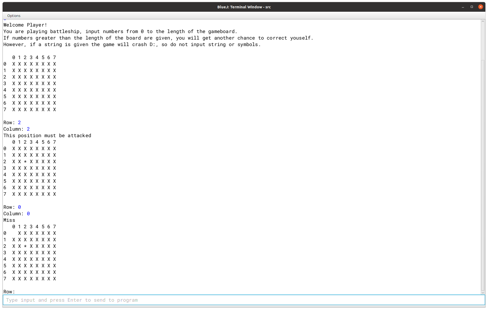
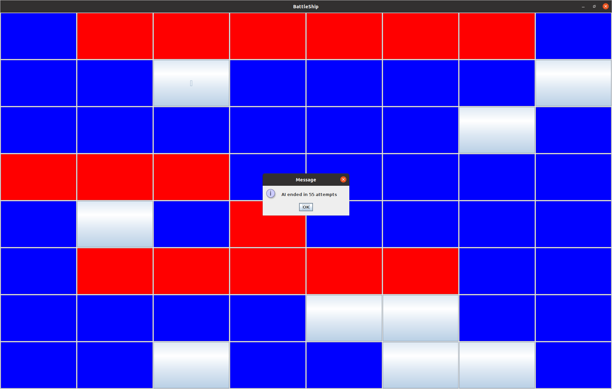
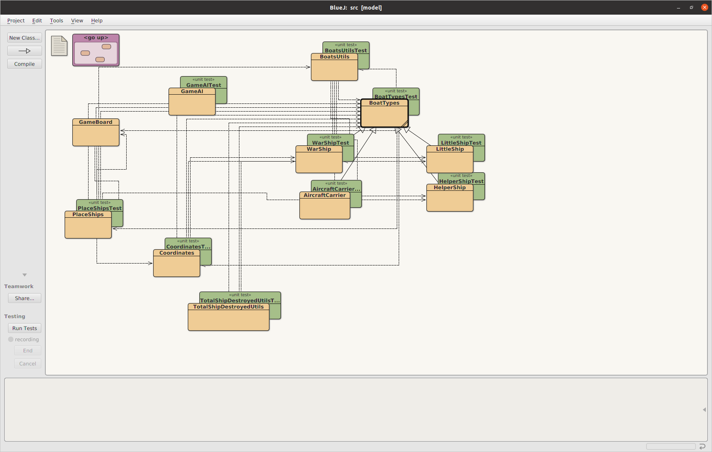
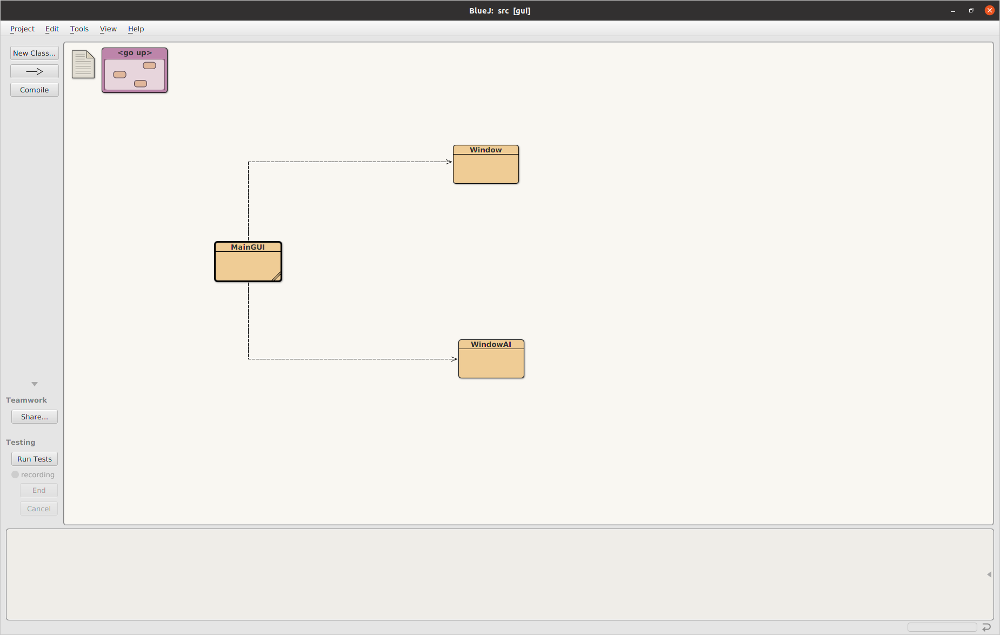
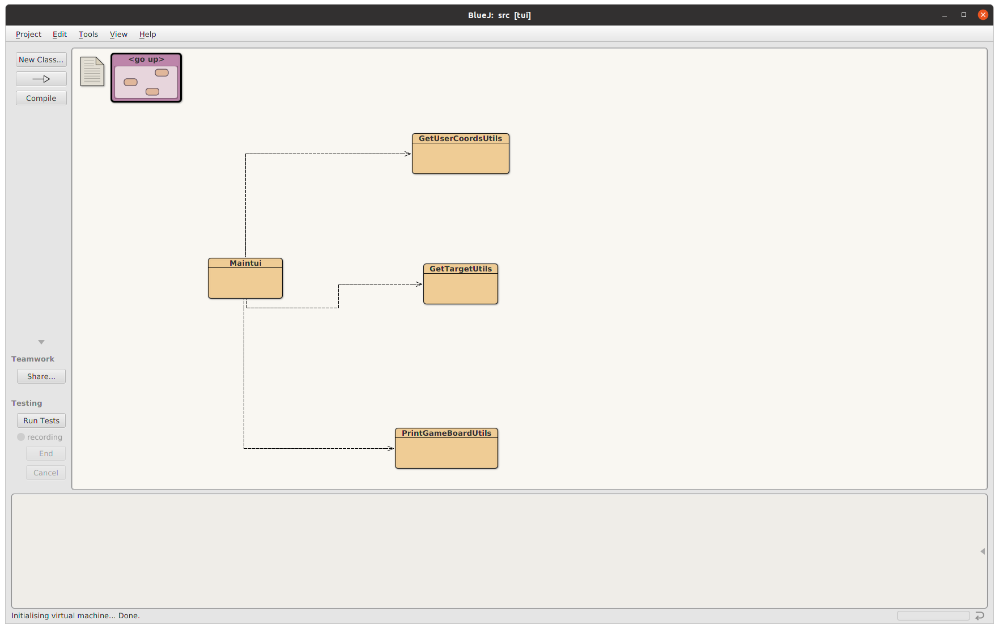

# Project Project_Vikings

The game is called Battle Ship. It is based on an 8 by 8 square where ships are randomly placed. There are four different types of ships. The goal of the game is to destroy all the ships by launching "bomb" on certain coordinates. The faster you destroy them all, the better it is. 
There is a single player mode to play the game and destroy all the ships. Nevertheless, after you have destroyed them all, there is the possibility to let an AI play which does the same job and eventually it is compared who did better by using less attempts. Also, there is the possibility to only let the AI play itself.
In the game, there is only one type of AI, which is random, meaning that hits coordinates randomly and it is easy to beat.
The colors in the gui work perfectly on linux; however, we have found out that they do not work as well on Mac. For this reason, there might be the possibility that on Mac the colors in
the gui are showed as borders of the cells and do not fill them all.

## Team Members

* Federico Bonezzi (bonezf@usi.ch), Bonni03
* Carlo Pederiva (pederc@usi.ch), CarloPederiva

## Mentor

* Luca Chiodini

## Image Showing Most Important TUI's Aspect:

## Image Showing Most Important GUI's Aspect:

## Images Showing class Diagrams:

## How to run the application

To run the application from outside BlueJ, first build it with Maven.
This generates the compiled classes in the directory `target/classes`.

### Running the TUI

To run this application, with the TUI, from the command line:

java -cp target/classes tui.Maintui

When the tui is started you can choose to continue the game or 
quit the game.
If you continue you can then at the end of the game choose to also let play
the AI and see who finishes in less attempt.

### Running the GUI

To run this application, with the GUI, from the command line:

java -cp target/classes gui.Maingui

Started the gui you can choose to play as player, to let the AI play 
or to exit the game. At the end of a game it will be given this 
possibility again.
